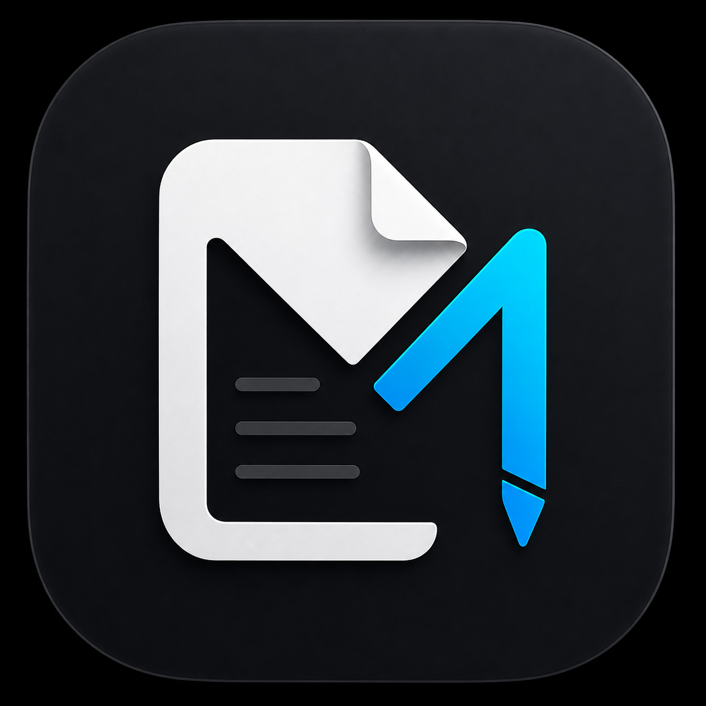
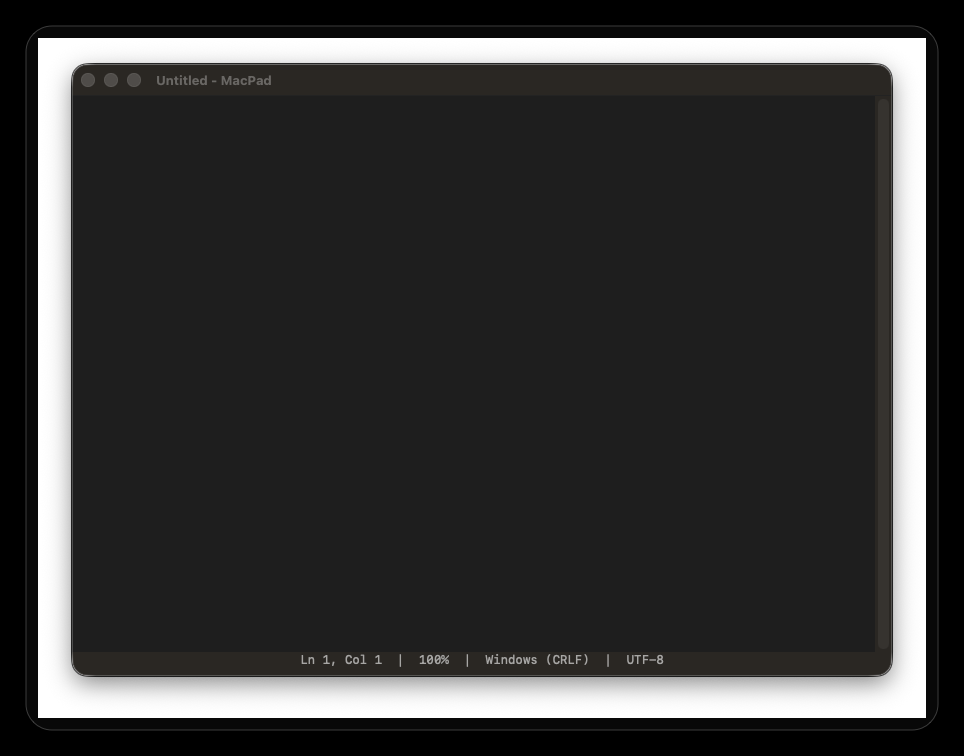

<h1>
  MacPad
  
</h1>

[](https://github.com/anvilfilbert/MacPad/releases/latest)
[](LICENSE)
[](Package.swift)

A small native macOS plain-text editor modeled after Windows `notepad.exe`.

[](https://deepwiki.com/anvilfilbert/MacPad)

<i>Want extensions, themes, and language-aware features? See [MacPad Pro](https://github.com/anvilfilbert/MacPadPro).</i>

<p align="center">
  
</p>

## Download

Download the latest ready-to-use app from:

```text
https://github.com/anvilfilbert/MacPad/releases/latest
```

Get `MacPad-1.0.7-macOS-universal.zip`, unzip it, and drag `MacPad.app` into Applications.

Release ZIPs include a matching `.sha256` checksum file.

If macOS warns that the app is from an unidentified developer, right-click `MacPad.app`, choose **Open**, then confirm **Open**. The app is locally signed but not Apple-notarized.

## Latest Changes

`1.0.7` hardens session restore and file opening: session state no longer stores document text, a Clear Session Data command is available, broad data files are no longer shown in Open, large files are rejected before loading, and release packages now include SHA-256 checksums.

See [CHANGELOG.md](CHANGELOG.md) for full release history.

## Features

- Plain-text editing with native undo, cut, copy, paste, delete, and select all
- New, open, save, save as, and print
- Multiple windows, each with multiple tabs
- New tabs and new windows, including separate windows with their own tab groups
- Session restore for open windows, tab groups, saved file tabs, and editor UI state without storing document text in preferences
- Unsaved-change prompts when closing or quitting
- Find, find next/previous, replace, and replace all
- Go to line and insert current time/date
- Word wrap toggle
- Font chooser and zoom controls
- Status bar showing line, column, zoom, line ending mode, and UTF-8
- Windows, Unix, and classic Mac line-ending detection and preservation
- Builds into a launchable universal `MacPad.app`
- Uses the included MacPad logo as the app icon

## Build

```sh
./scripts/build-app.sh
```

The app bundle is created at:

```text
build/MacPad.app
```

Launch it from Finder or with:

```sh
open build/MacPad.app
```

Install it into `/Applications` with:

```sh
./scripts/install-app.sh
```

Create a release zip with:

```sh
./scripts/package-release.sh
```
