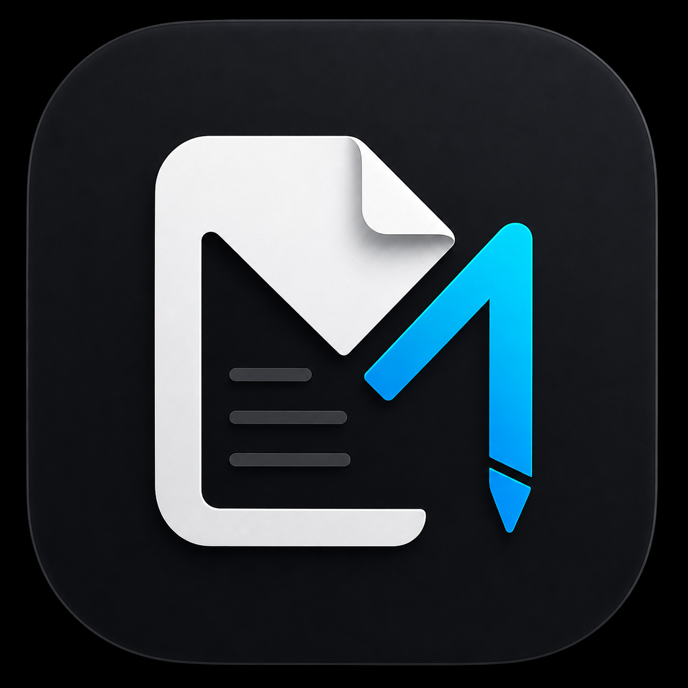
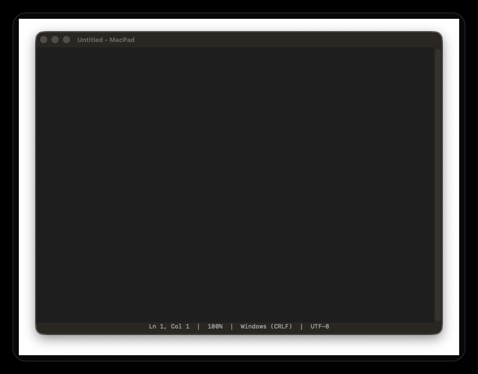

<h1>
  MacPad
  
</h1>

[](https://github.com/anvilfilbert/MacPad/releases/latest)
[](https://github.com/anvilfilbert/MacPad/actions/workflows/swift-ci.yml)
[](LICENSE)
[](Package.swift)

Ultra-fast native plain-text editor for macOS. No bloat.

## MacPad family

- [MacPad family website](https://anvilfilbert.github.io/) presents both apps.
- MacPad is the native macOS editor in this repository.
- [MacPad Mobile](https://github.com/anvilfilbert/MacPad-Mobile) is the native
  iPhone and iPad counterpart.

The apps are separate codebases and do not automatically synchronize open
documents, tabs, settings, or recovery data. Files stored in a shared location
can be opened explicitly from either app.

[](https://deepwiki.com/anvilfilbert/MacPad)

<p align="center">
  
</p>

## Download

Download the latest ready-to-use universal app:

[Download the latest MacPad universal app](https://github.com/anvilfilbert/MacPad/releases/latest/download/MacPad-macOS-universal.zip)

Unzip it and drag `MacPad.app` into Applications. The [latest release page](https://github.com/anvilfilbert/MacPad/releases/latest) also provides release notes.

GitHub is the canonical download source. A synchronized mirror is available on [SourceForge](https://sourceforge.net/projects/macpad-editor/files/latest/download).

Each release includes a matching `.sha256` checksum and GitHub build-provenance attestation.

If macOS warns that the app is from an unidentified developer, right-click `MacPad.app`, choose **Open**, then confirm **Open**. The app is locally signed but not Apple-notarized.

## Latest Changes

`1.3.1` restores Dock reopening when menu-bar mode keeps MacPad running after the last editor window closes.

See [CHANGELOG.md](CHANGELOG.md) for full release history.

## App Store preparation

Repository-local English and German metadata drafts, privacy and support
copy, compliance evidence, and unresolved owner gates are tracked in
[App Store preparation](docs/app-store-preparation.md). This is preparation
material only: it does not mean MacPad has been production-signed, notarized,
submitted, approved, distributed, or published on the Mac App Store.

## Features

- Plain-text editing with native undo, cut, copy, paste, delete, and select all
- New, open, Open Recent, save, save as, and print
- Multiple windows, each with multiple tabs
- New tabs and new windows, including separate windows with their own tab groups
- Optional OFF-by-default menu-bar launcher for opening a new empty window with one click
- Session restore for window positions, selected tabs, tab groups, saved file tabs, and editor UI state without storing document text in preferences
- Unsaved-change prompts when closing or quitting
- Find, find next/previous, replace, and replace all with Match Case and Wrap Around options
- Standard shortcuts including `Command-T` for a new tab, `Command-N` for a new window, and `Option-Command-F` for Replace
- Go to line and insert current time/date
- Word wrap toggle
- App-wide persistent font chooser and per-tab zoom controls
- VoiceOver labels, stable accessibility identifiers, and predictable keyboard focus order
- Status bar showing line, column, zoom, line ending mode, and detected file encoding
- UTF-8, UTF-8 BOM, UTF-16 LE/BE, Windows-1252, and ISO-8859-1 detection, preservation, and Save As conversion
- Windows, Unix, classic Mac, and mixed line-ending detection and preservation
- Builds into a launchable universal `MacPad.app`
- Uses the included MacPad logo as the app icon

## Build

```sh
./scripts/build-app.sh
```

The app bundle is created at:

```text
build/MacPad.app
```

Launch it from Finder or with:

```sh
open build/MacPad.app
```

Install it into `/Applications` with:

```sh
./scripts/install-app.sh
```

Create a release zip with:

```sh
./scripts/package-release.sh
```

Run the automated suite with:

```sh
swift test
```

## Community

- Read the [wiki](https://github.com/anvilfilbert/MacPad/wiki) for usage details.
- Use [Discussions](https://github.com/anvilfilbert/MacPad/discussions) for questions and ideas.
- Open an [issue](https://github.com/anvilfilbert/MacPad/issues/new/choose) for a reproducible bug or focused feature request.
- See [CONTRIBUTING.md](CONTRIBUTING.md) before submitting a pull request.

## License

MacPad is available under the [Apache License 2.0](LICENSE).

## Security

Report vulnerabilities through [GitHub private vulnerability reporting](https://github.com/anvilfilbert/MacPad/security/advisories/new). See [SECURITY.md](SECURITY.md) for policy details.
